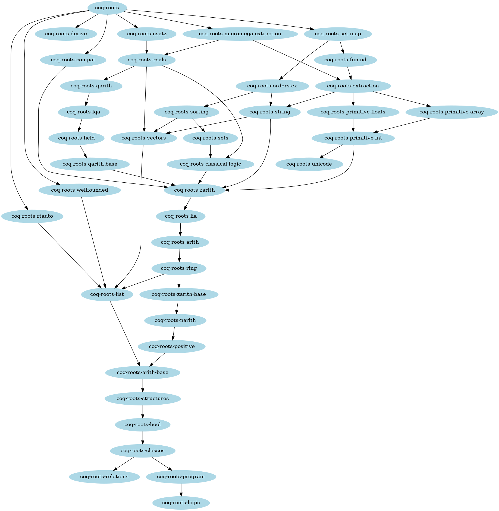

- Title: Boost stdlib development

- Drivers: Cyril Cohen (@CohenCyril) and Pierre Roux (@proux01)

----

# Summary

This CEP is about the technical details in making the standard library
an actual library, as listed in the
[Roadmap CEP](https://github.com/coq/ceps/pull/69).

# Motivation

As part of the promotion effort around the Coq Platform, we would like to
ensure that the stdlib does not enjoy special status and that Coq can be
used without it. We should consider stdlib components as libraries to
advertise for their own values as part of the Coq Platform packages, but
without their historical origin, or their development and release process
being tied to Coq, (mis)leading users to consider them as the only
officially recommended libraries.

In particular, we should:

- Identify consistent stdlib components that can be used independently
  from each other and that would be worth distributing as separate
  packages. Identify their maintainers and give them freedom to define
  the future of the components they maintain, in the limits set by the
  Coq Platform charter. Allow maintainers to extract stdlib components
  to maintain and evolve them outside the core Coq repository and to have
  their own release schedule and versioning scheme, in case they wish to
  do so.

- Extract the prelude + a minimum set of components that alternative
  general libraries like MathComp and coq-stdpp need as a basis.
  Make sure that this reduced core stdlib component can evolve to allow
  other libraries to use newer features of Coq (like universe polymorphism,
  SProp and primitive projections).
  Stop including any other stdlib components as part of the `coq` opam
  package and encourage maintainers of Coq packages in other distributions
  to do the same.

# Detailed design

## Prelude

We will keep a prelude shipped with Coq itself. Let's go with the
content of the `theories/Init` directory of Coq to start with.
To this we add `theories/Program/Basics.v`,
`theories/Program/Tactics.v`, `theories/Classes/Morphisms.v`,
`theories/Classes/SetoidTactics.v`, `theories/Classes/CMorphisms.v`,
`theories/Classes/Equivalence.v`,
`theories/Classes/RelationClasses.v`,
`theories/Classes/Morphisms_Prop.v`, `theories/Classes/Init.v`,
`theories/Classes/CRelationClasses.v`, `theories/Setoids/Setoid.v`,
and `theories/Relations/Relation_Definitions.v`.
This means that the scope of the standard library, adressed below, is
everything but `theories/Init` and the above files.

## Packages

### Proof of concept

Here is a first proposal for packages, see this
[proof of concept](https://github.com/proux01/roots) for details and small
changes enabling these dependencies.

### Dependency graph:

### Details

* coq-roots-logic
  * The Coq standard library, basic logic
  * Contains basic facts from Coq standard library in the namespace Coq.Logic
    Look at coq-roots-classical-logic for more elaborate results in namespace
    `Coq.Logic`.
  * 

contains:
 Logic/Adjointification.v,
    Logic/Eqdep_dec.v, Logic/JMeq.v, Logic/SetIsType.v,
    Logic/Berardi.v, Logic/ExtensionalFunctionRepresentative.v,
    Logic/ProofIrrelevance.v, Logic/StrictProp.v,
    Logic/ConstructiveEpsilon.v, Logic/ExtensionalityFacts.v,
    Logic/ProofIrrelevanceFacts.v, Logic/WeakFan.v, Logic/Decidable.v,
    Logic/FunctionalExtensionality.v, Logic/PropExtensionalityFacts.v,
    Logic/Eqdep.v, Logic/HLevels.v, Logic/PropFacts.v,
    Logic/EqdepFacts.v, Logic/Hurkens.v,
    Logic/RelationalChoice.v

* coq-roots-program
  * The Coq standard library, program
  * Additional support for dependently-typed programming.
    This can be useful in addition to the `Program` command from stdlib.
    Namespace `Coq.Program`
  * 

contains:
 Program/Syntax.v,
    Program/Equality.v, Program/Subset.v, Program/Program.v,
    Program/Combinators.v,
    Program/Wf.v, Program/Utils.v

* coq-roots-relations
  * The Coq standard library, relations
  * Relations (definitions and basic results) in addition to the ones from stdlib.
    Namespace `Coq.Relatons`
  * 

contains:

    Relations/Relation_Operators.v,
    Relations/Operators_Properties.v, Relations/Relations.v

* coq-roots-classes
  * The Coq standard library, classes in addition to the ones from stdlib.
  * Most of namespace `Coq.Classes`
  * 

contains:

    Classes/Morphisms_Relations.v, Classes/RelationPairs.v,
    Classes/SetoidClass.v,
    Classes/CEquivalence.v,
    Classes/DecidableClass.v

* coq-roots-bool
  * The Coq standard library, boolean arithmetic
  * Booleans (basic functions and results). Most of namespace `Coq.Bool`.
  * 

contains:
 Bool/IfProp.v, Bool/Bool.v,
    Bool/DecBool.v, Bool/BoolEq.v

* coq-roots-structures
  * The Coq standard library, structures
  * Basic "algebraic" structures: types with decidable equality and with order.
    Most of namespace `Coq;Structures`.
    Instances can be found in the coq-roots-orders-ex package.
    More developped algebra can be found in the mathematical components library: https://github.com/math-comp/math-comp
  * 

contains:
 Structures/GenericMinMax.v,
    Structures/Equalities.v, Structures/Orders.v,
    Structures/OrdersFacts.v, Structures/OrdersTac.v

* coq-roots-arith-base
  * The Coq standard library, natural number arithmetic
  * Basic Peano Arithmetic. Everything can be loaded with
    `From Coq Require Import Arith_base`. Most of namespace `Coq.Arith`. To enjoy
    the `ring` and `lia` automatic tactic, you additionally need the
    coq-roots-arith package and `From Coq Require Import Arith Lia.`
  * 

contains:

    theories/Numbers/NumPrelude.v, Numbers/NatInt/NZBase.v,
    Numbers/NatInt/NZOrder.v, Numbers/NatInt/NZProperties.v,
    Numbers/NatInt/NZDiv.v, Numbers/NatInt/NZParity.v,
    Numbers/NatInt/NZPow.v, Numbers/NatInt/NZSqrt.v,
    Numbers/NatInt/NZGcd.v, Numbers/NatInt/NZBits.v,
    Numbers/NatInt/NZDomain.v, Numbers/NatInt/NZAxioms.v,
    Numbers/NatInt/NZAddOrder.v, Numbers/NatInt/NZMul.v,
    Numbers/NatInt/NZLog.v, Numbers/NatInt/NZAdd.v,
    Numbers/NatInt/NZMulOrder.v,
    Numbers/Natural/Abstract/NStrongRec.v,
    Numbers/Natural/Abstract/NAdd.v,
    Numbers/Natural/Abstract/NAxioms.v,
    Numbers/Natural/Abstract/NDefOps.v,
    Numbers/Natural/Abstract/NSqrt.v,
    Numbers/Natural/Abstract/NDiv0.v,
    Numbers/Natural/Abstract/NBits.v, Numbers/Natural/Abstract/NGcd.v,
    Numbers/Natural/Abstract/NParity.v,
    Numbers/Natural/Abstract/NProperties.v,
    Numbers/Natural/Abstract/NMaxMin.v,
    Numbers/Natural/Abstract/NDiv.v, Numbers/Natural/Abstract/NPow.v,
    Numbers/Natural/Abstract/NAddOrder.v,
    Numbers/Natural/Abstract/NLcm0.v, Numbers/Natural/Abstract/NLog.v,
    Numbers/Natural/Abstract/NMulOrder.v,
    Numbers/Natural/Abstract/NIso.v, Numbers/Natural/Abstract/NSub.v,
    Numbers/Natural/Abstract/NBase.v, Numbers/Natural/Abstract/NLcm.v,
    Numbers/Natural/Abstract/NOrder.v, Classes/SetoidDec.v,
    Arith/EqNat.v, Arith/Compare.v, Arith/PeanoNat.v,
    Arith/Arith_base.v, Arith/Cantor.v, Arith/Euclid.v,
    Arith/Factorial.v, Arith/Between.v, Arith/Wf_nat.v,
    Arith/Compare_dec.v, Arith/Bool_nat.v, Arith/Peano_dec.v, Bool/Zerob.v

* coq-roots-positive
  * The Coq standard library, binary positive integers
  * Binary representation of positive integers for efficient
    computation.  Namespace `Coq.PArith`. You may also want the
    coq-roots-nzarith package for N and Z built on top of positive.
  * 

contains:
 Numbers/BinNums.v,
    Numbers/AltBinNotations.v, PArith/Pnat.v, PArith/POrderedType.v,
    PArith/BinPos.v, PArith/PArith.v, PArith/BinPosDef.v

* coq-roots-list
  * The Coq standard library, lists and streams
  * Polymorphic (simply linked) lists and streams (infinite sequences).
    Most of namespace `Coq.Lists`.
  * 

contains:
 Lists/ListDec.v,
    Lists/Streams.v, Lists/List.v, Lists/StreamMemo.v,
    Lists/ListSet.v, Lists/ListTactics.v, Numbers/NaryFunctions.v,
    Logic/WKL.v, Classes/EquivDec.v

* coq-roots-vectors
  * The Coq standard library, vectors
  * Dependent datastructures storing their length. Namespace
    `Coq.Vectors`. This is known to be technically difficult to
    use. It is often better to use a dependent pair with a list and a
    proof about its length, as provided by the `tuple` type in package
    coq-mathcomp-ssreflect, allowing almost transparent mixing with
    lists.
  * 

contains:
 Vectors/VectorEq.v,
    Vectors/VectorDef.v, Vectors/Vector.v, Vectors/Fin.v,
    Vectors/VectorSpec.v, Bool/Bvector.v, Logic/FinFun.v

* coq-roots-narith
  * The Coq standard library, binary natural numbers base package.
    Use coq-roots-zarith for more functionalities with the `ring`
    and `Lia` tactics. Namespace `Coq.NArith`.
  * 

contains:
 theories/NArith/BinNatDef.v,
    theories/NArith/BinNat.v, theories/NArith/Nnat.v,
    theories/NArith/Ndigits.v, theories/NArith/Ndiv_def.v,
    theories/NArith/Ndist.v, theories/NArith/Ndec.v,
    theories/NArith/Ngcd_def.v, theories/NArith/Nsqrt_def.v,
    theories/NArith/NArith.v

* coq-roots-zarith-base
  * The Coq standard library, binary integers base package.
    Use coq-roots-zarith for more functionalities with the `ring`
    and `Lia` tactics. Namespace `Coq.ZArith`.
  * 

contains:

    theories/Numbers/Integer/Abstract/ZSgnAbs.v,
    theories/Numbers/Integer/Abstract/ZAxioms.v,
    theories/Numbers/Integer/Abstract/ZAddOrder.v,
    theories/Numbers/Integer/Abstract/ZProperties.v,
    theories/Numbers/Integer/Abstract/ZDivTrunc.v,
    theories/Numbers/Integer/Abstract/ZParity.v,
    theories/Numbers/Integer/Abstract/ZMul.v,
    theories/Numbers/Integer/Abstract/ZPow.v,
    theories/Numbers/Integer/Abstract/ZAdd.v,
    theories/Numbers/Integer/Abstract/ZDivFloor.v,
    theories/Numbers/Integer/Abstract/ZMulOrder.v,
    theories/Numbers/Integer/Abstract/ZDivEucl.v,
    theories/Numbers/Integer/Abstract/ZMaxMin.v,
    theories/Numbers/Integer/Abstract/ZGcd.v,
    theories/Numbers/Integer/Abstract/ZLt.v,
    theories/Numbers/Integer/Abstract/ZLcm.v,
    theories/Numbers/Integer/Abstract/ZBase.v,
    theories/Numbers/Integer/Abstract/ZBits.v,
    theories/ZArith/BinIntDef.v, theories/ZArith/BinInt.v,
    theories/ZArith/Zcompare.v, theories/ZArith/Zorder.v,
    theories/ZArith/Zminmax.v, theories/ZArith/Zmin.v,
    theories/ZArith/Zmax.v, theories/ZArith/Znat.v,
    theories/ZArith/ZArith_dec.v, theories/ZArith/Zabs.v,
    theories/ZArith/auxiliary.v, theories/ZArith/Zbool.v,
    theories/ZArith/Zmisc.v, theories/ZArith/Wf_Z.v,
    theories/ZArith/Zhints.v, theories/ZArith/ZArith_base.v,
    theories/ZArith/Zeven.v, theories/ZArith/Zpow_alt.v,
    theories/ZArith/Zeuclid.v, theories/ZArith/Int.v

* coq-roots-ring
  * The Coq standard library, `ring` tactic.
    Namespace `Coq.setoid_ring`.
  * 

contains:

    theories/ZArith/Ring/Zpow_def.v,
    theories/ZArith/Ring/Znumtheory.v,
    theories/ZArith/Ring/Zcomplements.v, theories/ZArith/Ring/Zdiv.v,
    theories/setoid_ring/Ncring_polynom.v,
    theories/setoid_ring/Rings_Z.v,
    theories/setoid_ring/Ncring_initial.v,
    theories/setoid_ring/Ring_polynom.v,
    theories/setoid_ring/ZArithRing.v,
    theories/setoid_ring/Integral_domain.v,
    theories/setoid_ring/Ring_base.v, theories/setoid_ring/BinList.v,
    theories/setoid_ring/Ncring.v, theories/setoid_ring/Ring.v,
    theories/setoid_ring/Algebra_syntax.v,
    theories/setoid_ring/InitialRing.v, theories/setoid_ring/Cring.v,
    theories/setoid_ring/Ncring_tac.v,
    theories/setoid_ring/Ring_tac.v, theories/setoid_ring/ArithRing.v,
    theories/setoid_ring/NArithRing.v,
    theories/setoid_ring/Ring_theory.v

* coq-roots-arith
  * The Coq standard library, unary natural numbers.
    Namespace `Coq.Arith`.
  * 

contains:

    theories/Arith/Arith.v</detail>
* coq-roots-lia
  * The Coq standard library, `lia` tactic.
    Namespace `Coq.micromega`.
  * 

contains:

    theories/omega/OmegaLemmas.v, theories/omega/PreOmega.v,
    theories/micromega/ZifyN.v, theories/micromega/ZifyComparison.v,
    theories/micromega/ZifyClasses.v, theories/micromega/ZifyNat.v,
    theories/micromega/ZifyPow.v, theories/micromega/ZifyBool.v,
    theories/micromega/Zify.v, theories/micromega/ZifyInst.v,
    theories/micromega/DeclConstantZ.v,
    theories/micromega/OrderedRing.v, theories/micromega/Tauto.v,
    theories/micromega/Env.v, theories/micromega/Refl.v,
    theories/micromega/ZArith_hints.v,
    theories/micromega/ZMicromega.v, theories/micromega/EnvRing.v,
    theories/micromega/Lia.v, theories/micromega/VarMap.v,
    theories/micromega/Ztac.v, theories/micromega/ZCoeff.v,
    theories/micromega/RingMicromega.v</detail>
* coq-roots-zarith
  * The Coq standard library, binary integers
  * Binary encoding of integers. This binary encoding was initially
    developped to enable efficient computations, compared to the unary
    encoding of `nat`. Proofs were then added making the types usable
    for mathematical proofs, although this was not the initial
    intent. If even-more efficient computations are needed, look at
    the coq-roots-primitive-int package for 63 bits machine arithmetic or the
    coq-bignums package for arbitrary precision machine
    arithmetic. Everything can be imported with `From Coq Require
    Import NArith` or `From Coq Require Import ZArith`. Also contains
    the migromega tactic that can be loaded with `From Coq Require
    Import Lia.`. Most of namespaces `Coq.NArith` and `Coq.ZArith`.
  * 

contains:

    theories/Numbers/Natural/Binary/NBinary.v,
    theories/ZArith/Zpower.v, theories/ZArith/Zquot.v,
    theories/ZArith/Zpow_facts.v, theories/ZArith/Zgcd_alt.v,
    theories/ZArith/Zwf.v, theories/ZArith/ZArith.v,
    theories/ZArith/Zbitwise.v,
    theories/Numbers/Integer/Binary/ZBinary.v,
    theories/Numbers/Integer/NatPairs/ZNatPairs.v,
    theories/Numbers/DecimalN.v, theories/Numbers/DecimalNat.v,
    theories/Numbers/DecimalZ.v, theories/Numbers/DecimalFacts.v,
    theories/Numbers/DecimalPos.v, theories/Numbers/HexadecimalN.v,
    theories/Numbers/HexadecimalNat.v,
    theories/Numbers/HexadecimalZ.v,
    theories/Numbers/HexadecimalFacts.v,
    theories/Numbers/HexadecimalPos.v, theories/btauto/Algebra.v,
    theories/btauto/Reflect.v, theories/btauto/Btauto.v

* coq-roots-qarith-base
  * The Coq standard library, binary rational numbers base package.
    Use coq-roots-qarith for more functionalities with the `field`
    and `Lqa` tactics. Namespace `Coq.QArith`.
  * 

contains:
theories/QArith/Qreduction.v,
    theories/QArith/Qminmax.v, theories/QArith/QOrderedType.v,
    theories/QArith/QArith_base.v

* coq-roots-field
  * The Coq standard library, `field` tactic.
  * 

contains:
 theories/QArith/Qfield.v,
    theories/QArith/Qround.v, theories/QArith/Qring.v,
    theories/QArith/Qpower.v, theories/QArith/Qcanon.v,
    theories/setoid_ring/Field_theory.v,
    theories/setoid_ring/Field_tac.v, theories/setoid_ring/Rings_Q.v,
    theories/setoid_ring/Field.v

* coq-roots-lqa
  * The Coq standard library, `lqa` tactic.
  * 

contains:

    theories/micromega/QMicromega.v, theories/micromega/Lqa.v,
    theories/micromega/DeclConstant.v

* coq-roots-qarith
  * The Coq standard library, binary rational numbers
  * Binary rational numbers made on top of the coq-roots-nzarith
    package. These enable efficient computations in arbitrary
    precision exact rational arithmetic. Namespace `Coq.QArith`. These
    are known to be difficult to use for mathematical roofs because
    there is no canonical representation (2/3 and 4/6 are not equal
    for instance). For even more efficient computation, look at the
    coq-bignums package which uses machine integers. For mathematic
    proofs, the `rat` type of the coq-mathcomp-algebra package are
    much more comfortable, although they don't enjoy efficient
    computation (coq-coqeal offers a refinement with coq-bignums that
    enables to enjoy both aspects).
  * 

contains:
 theories/QArith/Qcabs.v,
    theories/QArith/Qabs.v, theories/QArith/QArith.v,
    theories/Numbers/DecimalQ.v,
    theories/Numbers/HexadecimalQ.v

* coq-roots-classical-logic
  * The Coq standard library, classical logic
  * Most of namespace `Coq.Logic`.
  * 

contains:

    Logic/IndefiniteDescription.v, Logic/Classical_Pred_Type.v,
    Logic/Classical_Prop.v, Logic/ClassicalFacts.v, Logic/Classical.v,
    Logic/Epsilon.v, Logic/ClassicalChoice.v, Logic/Description.v,
    Logic/ClassicalEpsilon.v, Logic/ChoiceFacts.v,
    Logic/PropExtensionality.v, Logic/ClassicalDescription.v,
    Logic/ClassicalUniqueChoice.v, Logic/SetoidChoice.v,
    Logic/Diaconescu.v

* coq-roots-reals
  * The Coq standard library, classical real numbers
  * Formalization of real numbers. Namespace `Coq.Reals`. Most of it
    an be loaded with `From Coq Require Import Reals.`. Also contains
    the micromega tactics, loadable with `From Coq Require Import
    Lra.`  and `From Coq Require Import Psatz`.
  * 

contains:
 Reals/Rtrigo_facts.v,
    Reals/Ranalysis2.v, Reals/Rbase.v, Reals/Reals.v,
    Reals/ArithProp.v, Reals/Rgeom.v, Reals/Exp_prop.v,
    Reals/Rtrigo.v, Reals/PartSum.v, Reals/SplitRmult.v,
    Reals/Rprod.v, Reals/Rsqrt_def.v, Reals/Ranalysis3.v,
    Reals/PSeries_reg.v, Reals/Rtrigo_calc.v, Reals/Raxioms.v,
    Reals/Ratan.v, Reals/Cos_plus.v, Reals/Rderiv.v, Reals/R_sqrt.v,
    Reals/R_sqr.v, Reals/Integration.v, Reals/Sqrt_reg.v,
    Reals/RiemannInt.v, Reals/Ranalysis_reg.v, Reals/NewtonInt.v,
    Reals/Rtrigo1.v, Reals/Rtrigo_fun.v, Reals/Ranalysis1.v,
    Reals/Abstract/ConstructiveLimits.v,
    Reals/Abstract/ConstructiveRealsMorphisms.v,
    Reals/Abstract/ConstructiveAbs.v,
    Reals/Abstract/ConstructiveLUB.v,
    Reals/Abstract/ConstructivePower.v,
    Reals/Abstract/ConstructiveReals.v,
    Reals/Abstract/ConstructiveSum.v,
    Reals/Abstract/ConstructiveMinMax.v, Reals/RList.v,
    Reals/Rsigma.v, Reals/Runcountable.v, Reals/Rpower.v,
    Reals/Rregisternames.v, Reals/RiemannInt_SF.v, Reals/Rbasic_fun.v,
    Reals/ROrderedType.v, Reals/SeqSeries.v, Reals/RIneq.v,
    Reals/DiscrR.v, Reals/SplitAbsolu.v,
    Reals/ClassicalDedekindReals.v, Reals/Rtrigo_def.v, Reals/R_Ifp.v,
    Reals/Rtopology.v, Reals/Rfunctions.v, Reals/Rtrigo_alt.v,
    Reals/ClassicalConstructiveReals.v, Reals/Cos_rel.v,
    Reals/Cauchy/ConstructiveRcomplete.v, Reals/Cauchy/QExtra.v,
    Reals/Cauchy/ConstructiveCauchyAbs.v, Reals/Cauchy/PosExtra.v,
    Reals/Cauchy/ConstructiveExtra.v,
    Reals/Cauchy/ConstructiveCauchyReals.v,
    Reals/Cauchy/ConstructiveCauchyRealsMult.v, Reals/Machin.v,
    Reals/Alembert.v, Reals/Ranalysis.v, Reals/MVT.v, Reals/Rlimit.v,
    Reals/Ranalysis4.v, Reals/Rdefinitions.v, Reals/Rcomplete.v,
    Reals/Ranalysis5.v, Reals/Binomial.v, Reals/Cauchy_prod.v,
    Reals/Rtrigo_reg.v, Reals/Rseries.v, Reals/AltSeries.v,
    Reals/Rminmax.v, Reals/Rpow_def.v, Reals/Rlogic.v,
    Reals/SeqProp.v, setoid_ring/RealField.v, setoid_ring/Rings_R.v,
    micromega/Lra.v, micromega/Psatz.v, micromega/Fourier_util.v,
    micromega/Fourier.v, micromega/RMicromega.v, QArith/Qreals.v,
    Numbers/DecimalR.v, Numbers/HexadecimalR.v

* coq-roots-nsatz
  * The Coq standard library, nsatz tactic
  * Nullstellensatz tactic nsatz. Namespace `Coq.nsatz`.
  * 

contains:
 nsatz/Nsatz.v,
    nsatz/NsatzTactic.v

* coq-roots-unicode
  * The Coq standard library, unicode alternative notations
  * Unicode alternative notations. Namespace `Coq.Unicode`.
  * 

contains:
 Unicode/Utf8_core.v,
    Unicode/Utf8.v

* coq-roots-primitive-int
  * The Coq standard library, primitive 63 bits integers
  * Interface for hardware integers (63 rather than 64 bits due to
    OCaml garbage collector). This enables very efficient arithmetic,
    for developing tactics for proofs by reflection for
    instance. Namespace `Coq.Numbers.Cyclic`.
  * 

contains:

    Numbers/Cyclic/Int63/PrimInt63.v, Numbers/Cyclic/Int63/Sint63.v,
    Numbers/Cyclic/Int63/Cyclic63.v, Numbers/Cyclic/Int63/Uint63.v,
    Numbers/Cyclic/Int63/Ring63.v, Numbers/Cyclic/Abstract/NZCyclic.v,
    Numbers/Cyclic/Abstract/DoubleType.v,
    Numbers/Cyclic/Abstract/CarryType.v,
    Numbers/Cyclic/Abstract/CyclicAxioms.v, micromega/ZifyUint63.v,
    micromega/ZifySint63.v

* coq-primitive-array
  * The Coq standard library, primitive persistent arrays
  * Imperative arrays with a functionnal interface. Enables efficient
    computations with arrays. Namespace `Coq.Array`.
  * 

contains:
 Array/PArray.v

* coq-primitive-floats
  * The Coq standard library, primitive floats
  * Interface to hardware floats for efficient computations. This
    offers a basic model of floating-point arithmetic but is not very
    usable alone. Look at the coq-flocq package for an actual model of
    floating-point arithmetic, including links to coq-roots-reals and
    the current coq-primitive-floats. Namespace `Coq.Floats`
  * 

contains:
 Floats/FloatOps.v,
    Floats/Floats.v, Floats/SpecFloat.v, Floats/PrimFloat.v,
    Floats/FloatLemmas.v, Floats/FloatAxioms.v,
    Floats/FloatClass.v

* coq-roots-string
  * The Coq standard library, strings
  * Implementation of string as list of ASCII characters. Namespace
    `Coq.Strings`.
  * 

contains:
 Strings/ByteVector.v,
    Strings/HexString.v, Strings/Ascii.v, Strings/String.v,
    Strings/OctalString.v, Strings/Byte.v, Strings/BinaryString.v,
    Numbers/DecimalString.v, Numbers/HexadecimalString.v

* coq-roots-extraction
  * The Coq standard library, extraction
  * Interface to the extraction module, load with
    `From Coq Require Extraction.`. Namespace `Coq.extraction`.
  * 

contains:
 extraction/Extraction.v,
    extraction/ExtrHaskellZInteger.v, extraction/ExtrHaskellZInt.v,
    extraction/ExtrHaskellNatNum.v, extraction/ExtrHaskellString.v,
    extraction/ExtrOcamlZInt.v, extraction/ExtrOcamlNativeString.v,
    extraction/ExtrOCamlFloats.v, extraction/ExtrOcamlNatBigInt.v,
    extraction/ExtrOcamlZBigInt.v, extraction/ExtrOcamlNatInt.v,
    extraction/ExtrHaskellNatInt.v, extraction/ExtrOcamlString.v,
    extraction/ExtrHaskellZNum.v, extraction/ExtrOcamlChar.v,
    extraction/ExtrOCamlPArray.v, extraction/ExtrOcamlBasic.v,
    extraction/ExtrOcamlIntConv.v, extraction/ExtrOCamlInt63.v,
    extraction/ExtrHaskellBasic.v,
    extraction/ExtrHaskellNatInteger.v

* coq-roots-micromega-extraction
  * The Coq standard library, extraction of micromega
  * 

contains:

    micromega/MExtraction.v

* coq-roots-funind
  * The Coq standard library, funind
  * Interface for the funind plugin. Namespace `Coq.funind`
  * 

contains:
 funind/FunInd.v,
    funind/Recdef.v

* coq-roots-sets
  * The Coq standard library, sets
  * Classical sets. This is known to be outdated. More modern
    alternatives can be found in coq-mathcomp-ssreflect (for finite
    sets) and coq-mathcomp-classical (for classical sets) or
    coq-stdpp. Namespace `Coq.Sets`.
* coq-roots-sorting
  * The Coq standard library, sorting algorithms
  * Axiomatizations of sorts. Namespace `Coq.Sorting`.
  * 

contains:
 Sets/Partial_Order.v,
    Sets/Multiset.v, Sets/Uniset.v, Sets/Relations_2.v, Sets/Image.v,
    Sets/Relations_3.v, Sets/Relations_1.v, Sets/Classical_sets.v,
    Sets/Finite_sets.v, Sets/Permut.v, Sets/Integers.v,
    Sets/Finite_sets_facts.v, Sets/Powerset_facts.v, Sets/Powerset.v,
    Sets/Powerset_Classical_facts.v, Sets/Ensembles.v,
    Sets/Relations_1_facts.v, Sets/Constructive_sets.v,
    Sets/Infinite_sets.v, Sets/Relations_2_facts.v,
    Sets/Relations_3_facts.v, Sets/Cpo.v

* coq-roots-orders-ex
  * The Coq standard library, sorting algorithms
  * Instances of order structures from
    coq-roots-structures. Namespace `Coq.Structures`.
  * 

contains:
 Bool/BoolOrder.v,
    Structures/OrdersEx.v, Structures/OrdersLists.v,
    Structures/EqualitiesFacts.v, Structures/OrderedTypeAlt.v,
    Structures/DecidableType.v, Structures/OrderedTypeEx.v,
    Structures/OrdersAlt.v, Structures/DecidableTypeEx.v,
    Structures/OrderedType.v

* coq-roots-set-map
  * The Coq standard library, finite sets and maps
  * Modular implementation of finite sets/maps using lists or
    efficient trees. Namespaces `Coq.FSets` and `Coq.MSets`.
  * 

contains:
 FSets/FMapInterface.v,
    FSets/FSetInterface.v, FSets/FSetWeakList.v, FSets/FSetAVL.v,
    FSets/FSetCompat.v, FSets/FSetDecide.v, FSets/FSetList.v,
    FSets/FSetProperties.v, FSets/FMapList.v, FSets/FMapFacts.v,
    FSets/FSetPositive.v, FSets/FMapFullAVL.v,
    FSets/FSetToFiniteSet.v, FSets/FMapAVL.v, FSets/FMapPositive.v,
    FSets/FSets.v, FSets/FMaps.v, FSets/FSetFacts.v,
    FSets/FSetEqProperties.v, FSets/FSetBridge.v,
    FSets/FMapWeakList.v, MSets/MSetList.v, MSets/MSetDecide.v,
    MSets/MSets.v, MSets/MSetWeakList.v, MSets/MSetGenTree.v,
    MSets/MSetAVL.v, MSets/MSetInterface.v, MSets/MSetFacts.v,
    MSets/MSetProperties.v, MSets/MSetRBT.v, MSets/MSetPositive.v,
    MSets/MSetToFiniteSet.v, MSets/MSetEqProperties.v

* coq-roots-compat
  * The Coq standard library, compatibility files
  * Some compatibility files with older versions. Namespace `Coq.Compat`.
  * 

contains:
 Compat/AdmitAxiom.v,
    Compat/Coq817.v, Compat/Coq819.v, Compat/Coq818.v,
    Compat/Coq820.v

* coq-roots-derive
  * The Coq standard library, derive
  * Namespace `Coq.derive`
  * 

contains:

    theories/derive/Derive.v

* coq-roots-rtauto
  * The Coq standard library, rtauto
  * Namespace `Coq.rtauto`
  * 

contains:
 rtauto/Bintree.v,
    rtauto/Rtauto.v

* coq-roots-wellfounded
  * The Coq standard library, wellfounded
  * Namespace `Coq.wellfounded`
  * 

contains:
 Wellfounded/Inclusion.v,
    Wellfounded/Wellfounded.v, Wellfounded/Union.v,
    Wellfounded/Transitive_Closure.v, Wellfounded/Well_Ordering.v,
    Wellfounded/Inverse_Image.v, Wellfounded/Disjoint_Union.v,
    Wellfounded/Lexicographic_Product.v,
    Wellfounded/Lexicographic_Exponentiation.v

* coq-roots
  * The Coq standard library
  * A metapackage for all coq-roots-* packages constituting
    the historical Coq standard library, that used to be shipped with Coq.

theories/ssr and theories/ssrmatching should go back into mathcomp
(either in coq-mathcomp-ssreflect or in a new coq-mathcomp-ssr
containing only that).

## Mono/multi repo

Let's start with a mono repo with all above packages, then maintainers
could agree on further repo split if need be.

## Maintainers

We should do an open call for maintainers. Current maintainers (stdlib
team from Coq on github) will become roots maintainer, they can of
course opt out at any time.

## Documentation

Keep the current coqdoc documentation plus the small part of the
sphinx refman. Also need to document the above split in packages
(could help structure the doc). Links on Coq website will need to be
updated.

## Test Suite

We need to split the current `test-suite` directory of Coq between
tests that are actually testing Coq and tests that only test the
standard library, or crucially need it. A first quick look seems to
indicate that among the about 2500 tests currently in `test-suite/`,
about 500 should go in roots and about 100 in ssreflect, while the
remaining could remain in Coq without requiring the stdlib.

## CI

Have an initial CI setup including all things using the stdlib in
current Coq CI (that is virtually the whole Coq CI currently). Coq CI
should then require that anything applying for inclusion there,
and using the stdlib, should first enter the stdlib CI, in order to
ensure that development of the standard library doesn't break Coq CI.

# Drawbacks

The stdlib will no longer come bundled with Coq. It will however be
just as easy to install via the usual package managers. More notably
it will remain an integral part of the Coq Platform.

# Alternatives

Other split in multiple repositories would be possible, could still
happen in the future, maybe not needed now. The extreme opposite would
be to lean toward a huge monorepo with everything from the platform,
probably not very practical, and wouldn't bring much since the
platform already ensures uniform releases bundling everything.
To our knowledge the monorepo approach has exactly one advantage:
it is easier to backport changes from one package to an upstream package.
It also has one major drawback: it makes it harder to have the following dependencies:
`coq-roots-A <- coq-extralib-B <- coq-roots-C`.
